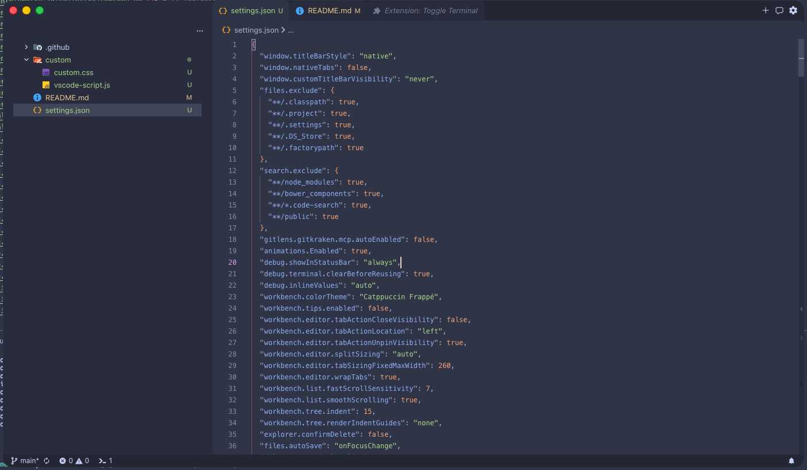

# VSCode Config

## Extensions

- [Better Comments](https://open-vsx.org/extension/aaron-bond/better-comments)
- [Catppuccin Theme](https://open-vsx.org/extension/Catppuccin/catppuccin-vsc)
- [Custom UI Style](https://open-vsx.org/extension/subframe7536/custom-ui-style)
- [Error Lens](https://open-vsx.org/extension/usernamehw/errorlens)
- [Material Icon Theme](https://open-vsx.org/extension/PKief/material-icon-theme)
- [Material Product Icons](https://open-vsx.org/extension/PKief/material-product-icons)
- [Toggle Terminal](https://open-vsx.org/extension/krish-r/vscode-toggle-terminal)

## Settings

Copy the contents from `settings.json` to `~/.config/vscode/settings.json`.

## Custom CSS

Copy the contents from `custom` folder to `~/.config/vscode/`.
Update `custom-ui-style.external.imports` in `settings.json` with the path to the custom.css file.
